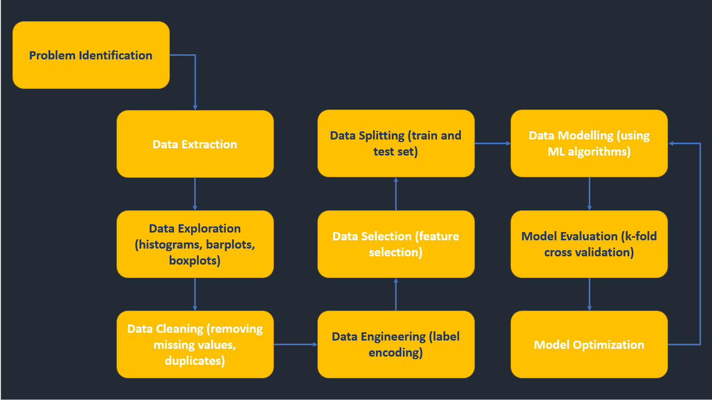

<!-- INTRODUCTION -->

# NOAA Check Reef Bleaching

Ananlysis of the NOAA reef bleaching dataset to check coral reefs' bleaching around the world.

*[NOAA](https://www.noaa.gov/) (National Oceanic and Atmospheric Administration) understands and predicts changes in climate, weather, oceans, and coasts. It shares this with others to help conserve and manage coastal and marine ecosystems and resources.*

<!-- ABOUT THE PROJECT -->

## Overview

  
Contents

  <ul>
    <li>
      <a href="#problem-statement">Problem Statement</a>
    </li>
    <li>
      <a href="#objective">Objective</a>
    </li>
    <li>
      <a href="#dataset">Dataset</a>
    </li>
    <li>
      <a href="#process-flow">Process Flow</a>
    </li>
    <li>
      <a href="#libraries-used">Libraries Used</a>
    </li>
    <li>
      <a href="#data-analysis-and-visualization">Data Analysis and Visualization</a>
    </li>
    <li>
      <a href="#model-used">Model Used</a>
    </li>
    <li>
      <a href="#predicted-output">Predicted Output</a>
    </li>
    <li>
      <a href="#references">References</a>
    </li>
  </ul>

<!-- DETAILED EXPLANATION -->

## Problem Statement
🤔
> Coral reefs are an integral part of the ecosystem for life underwater. They protect coastal areas and provide an income source to millions of people.
> But over the past few decades they have been affected by industrialization and other human-induced factors.
> This has resulted in coral reef bleaching in various oceans which in turn is reducing their growth rates and making them susceptible to diseases.

## Objective
🎯
> The aim of coral reefs' bleaching analysis is to identify the prime factors which affect reef bleaching in different areas and to further understand how gravely each of these factors causes bleaching in different oceans.

## Dataset
📊
> The [dataset](https://www.kaggle.com/oasisdata/noaa-reef-check-coral-bleaching-data) contains the following attributes.
> 
> * Bleaching
> * Ocean
> * Year
> * Depth
> * Storms
> * Human Impact
> * Siltation
> * Dynamite
> * Poison
> * Sewage
> * Industrial
> * Commercial

## Process Flow
🎞️
> The dataset will be analyzed in the following manner.
> 
> 

  
  

  
## Libraries Used
📚
> [`numpy`](https://numpy.org/doc/stable/)  adds support for large, multi-dimensional arrays and matrices, along with a large collection of high-level mathematical functions to operate on these arrays.
> 
> [`matplotlib`](https://matplotlib.org/stable/) is a plotting library for the Python programming language and its numerical mathematics extension NumPy. It provides an object-oriented API for embedding plots into applications using general-purpose GUI toolkits.
> 
> [`scipy`](https://scipy.github.io/devdocs/index.html) is used for scientific computing and technical computing. It contains modules for optimization, linear algebra, integration, interpolation, special functions, FFT, signal and image processing, ODE solvers and other tasks.
> 
> [`pandas`](https://pandas.pydata.org/pandas-docs/stable/reference/api/pandas.DataFrame.html) is for data manipulation and analysis. In particular, it offers data structures and operations for manipulating numerical tables and time series.
> 
> [`sklearn`](https://scikit-learn.org/stable/) or scikit-learn features various classification, regression and clustering algorithms and is designed to interoperate with the Python numerical and scientific libraries NumPy and SciPy.
> 
> [`seaborn`](https://seaborn.pydata.org/) is a Python data visualization library based on matplotlib. It provides a high-level interface for drawing attractive and informative statistical graphics.

## Data Analysis and Visualization
👀
> The data has been analyzed using the following 3 methods:
> 
> 1. [Jupyter Notebook](https://github.com/Aadya178/NOAA-Check-Reef-Bleaching/blob/main/NOAA%20Reef%20Bleaching.ipynb)
> 
> 2. [Zoho Analytics](https://github.com/Aadya178/NOAA-Check-Reef-Bleaching/blob/main/Zoho%20Analytics.md)
> 
> 3. [Google Spreadsheets](https://github.com/Aadya178/NOAA-Check-Reef-Bleaching/blob/main/Google%20Spreadsheets.md)

## Model Used
🤖
> The output is, given certain factors (which may cause reef bleaching), whether or not the coral reef has actually been bleached.
> 
> The model has been trained using Logistic Regression algorithm.
> 
> The target variable is `Bleaching`.

## Predicted Output
💯 
> 
> The accuracy of the output prediction is greater than 96%.
> 
> The model's accuracy is being evaluated using K-fold cross-validation.
> 
> The evaluation metrics include RMSE(Root Mean Square Error) and R2 score.

## References
🔖
> The following links were used to style this README -
> 
> https://github.com/othneildrew/Best-README-Template/
> 
> https://github.com/xnbox/DeepfakeHTTP/

👋🏻 Hi! Thanks for stopping by. Give it a ⭐ if you like it!
