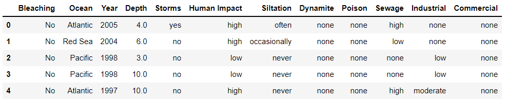

<!-- INTRODUCTION -->

# NOAA Check Reef Bleaching

Ananlysis of the NOAA reef bleaching dataset to check coral reefs' bleaching around the world.

*[NOAA](https://www.noaa.gov/) (National Oceanic and Atmospheric Administration) understands and predicts changes in climate, weather, oceans, and coasts. It shares this with others to help conserve and manage coastal and marine ecosystems and resources.*

<!-- ABOUT THE PROJECT -->

## Overview

  
Contents

  <ul>
    <li>
      <a href="#problem-statement">Problem Statement</a>
    </li>
    <li>
      <a href="#objective">Objective</a>
    </li>
    <li>
      <a href="#dataset">Dataset</a>
    </li>
    <li>
      <a href="#process-flow">Process Flow</a>
    </li>
    <li>
      <a href="#data-visualization">Data Visualization</a>
    </li>
    <li>
      <a href="#model-used">Model Used</a>
    </li>
    <li>
      <a href="#predicted-output">Predicted Output</a>
    </li>
    <li>
      <a href="#references">References</a>
    </li>
  </ul>

<!-- DETAILED EXPLANATION -->

## Problem Statement
🤔
> Coral reefs are an integral part of the ecosystem for life underwater. They protect coastal areas and provide an income source to millions of people.
> But over the past few decades they have been affected by industrialization and other human-induced factors.
> This has resulted in coral reef bleaching in various oceans which in turn is reducing their growth rates and making them susceptible to diseases.

## Objective
🎯
> The aim of coral reefs' bleaching analysis is to identify the prime factors which affect reef bleaching in different areas and to further understand how gravely each of these factors causes bleaching in different oceans.

## Dataset
📊
> The [dataset](https://www.kaggle.com/oasisdata/noaa-reef-check-coral-bleaching-data) contains the following columns which have been identified as the prime causes of reef bleaching.
> 
> * Storms
> * Human Impact
> * Siltation
> * Dynamite
> * Poison
> * Sewage
> * Industrail
> * Commercial
> 
> 

  
  

## Process Flow
🎞️
> The dataset will be analyzed in the following manner.
> 
> 

  
  

## Data Visualization
👀
> Boxplot
>
> 

  
  

> Barplot
>
> 

  
  

> Histogram
>
> 

  
  

> Scatterplot
>
> 

  
  

> Bleaching vs Ocean
>
> 

  
  

> Bleaching vs Year
> 
> 

  
  

> Year-wise Bleaching
> 
> 

  
  

> Year-wise Storms
> 
> 

  
  

> Storm occurence considering Human Impact and Year
> 
> 

  
  

## Model Used
🤖
> The output is given certain factors (which may cause reef bleaching) whether or not the coral reef has actually been bleached.
> 
> The accuracy of the output prediction is greater than 96%.
> 
> The model is being trained using Logistic Regression algorithm.
> 
> The target variable is `Bleaching`.

## Predicted Output
💯 
> The model's accuracy is being evaluated using K-fold cross-validation.
> 
> The evaluation metrics include RMSE(Root Mean Square Error) and R2 score.

## 🔖 References

> The following linkes were used to style this README -
> 
> https://github.com/athityakumar/colorls/
> 
> https://github.com/othneildrew/Best-README-Template/
> 
> https://github.com/chroline/well_app/
> 
> https://github.com/xnbox/DeepfakeHTTP/

